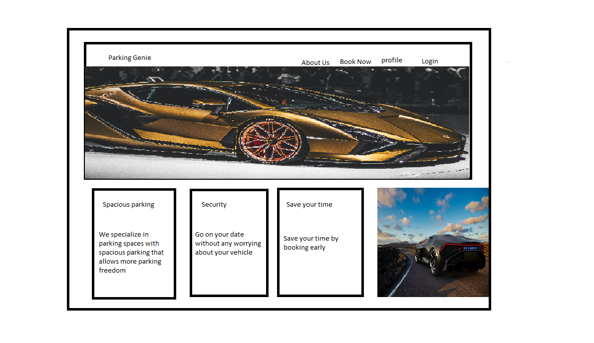
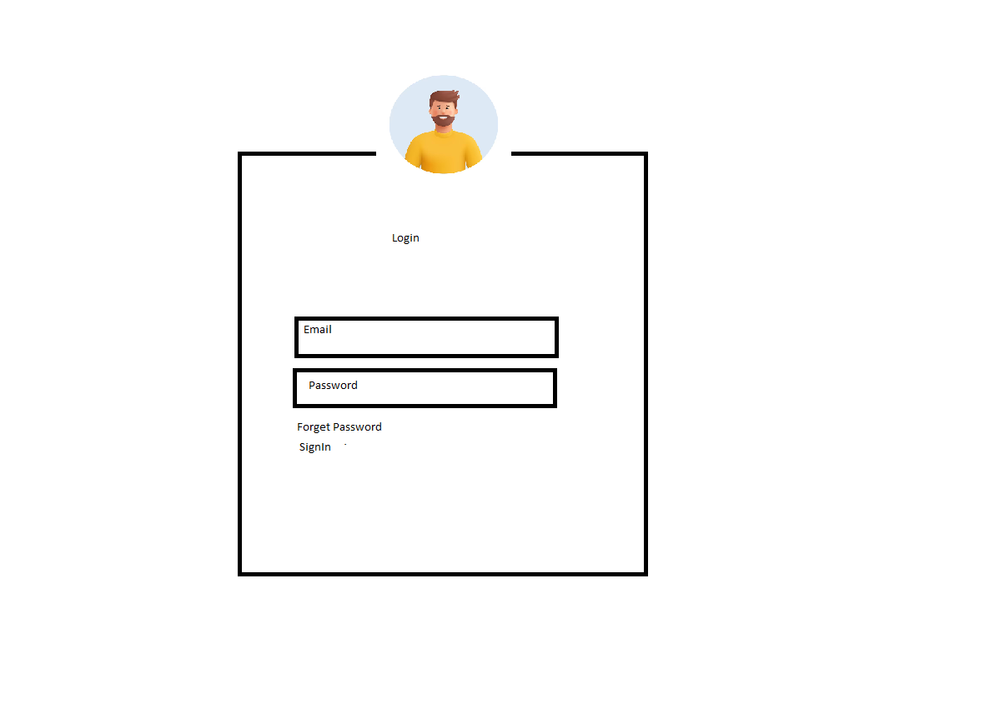
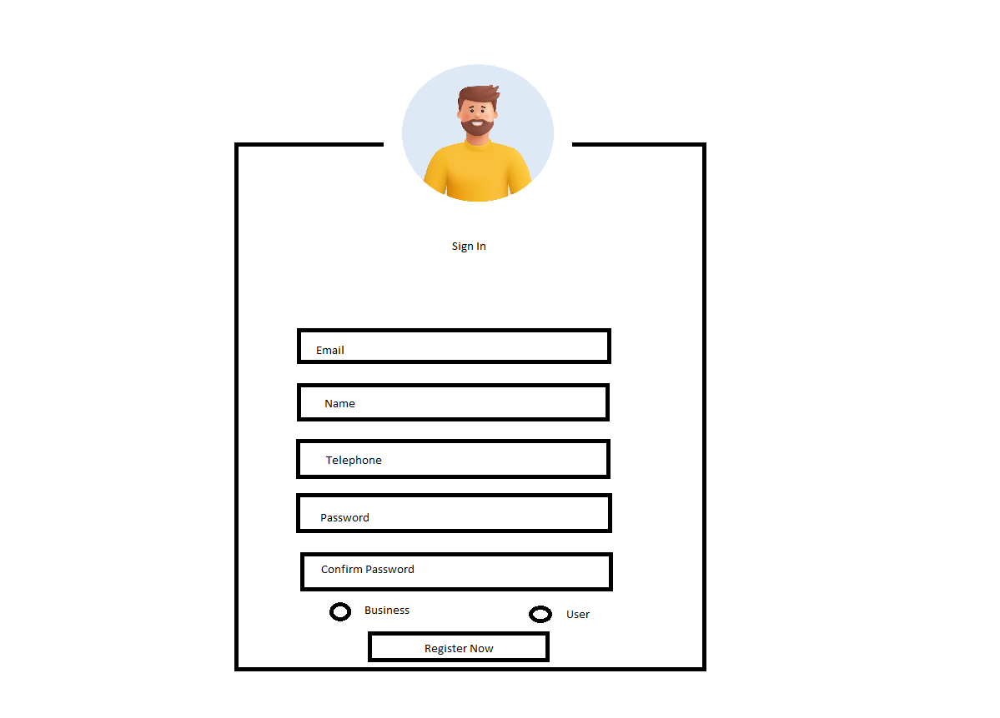
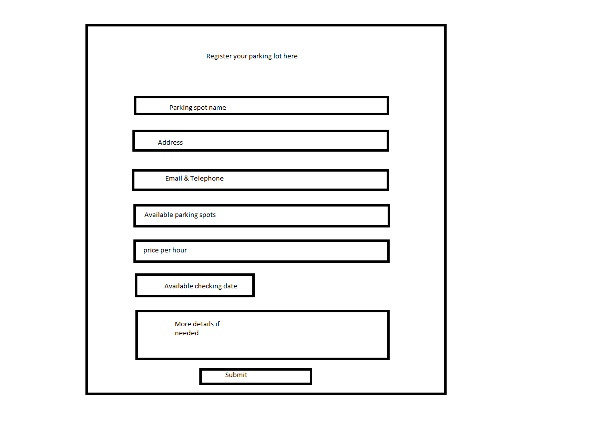
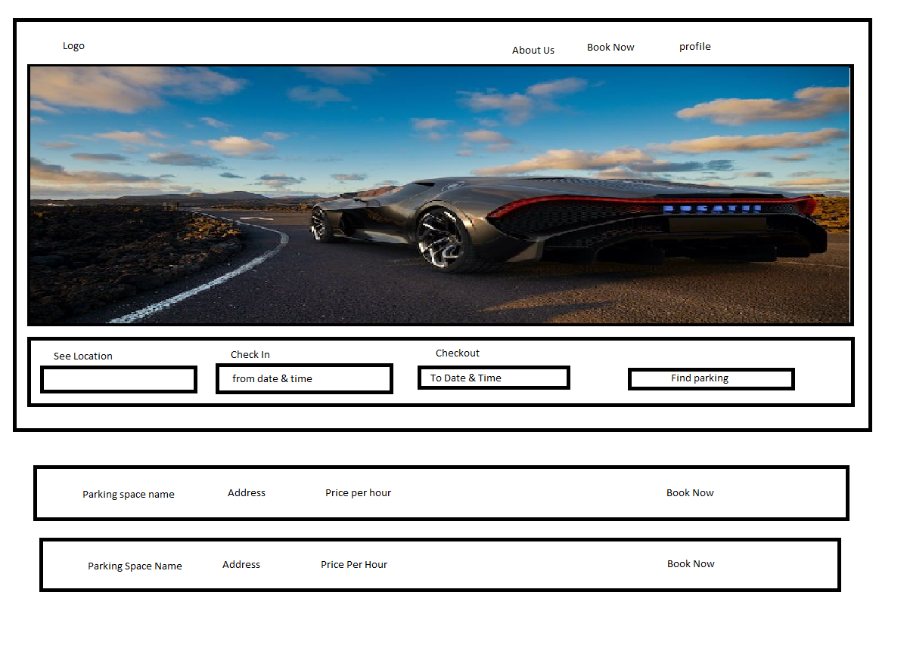
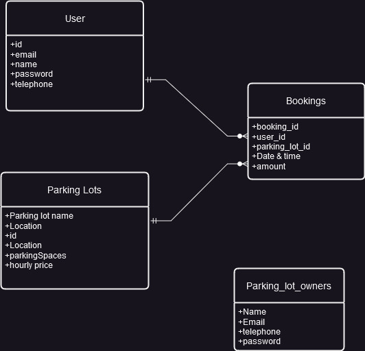

# Project Title
Easy & Smart Parking

## Overview

What is your app? Brief description in a couple of sentences.
This is a website for people find parking spost in busy areas so they don't have toworry about finding parking space.

### Problem

Why is your app needed? Background information around any pain points or other reasons.
Finding parking spaces in busy areas can be a daunting task, especially for those who aren't frequent travelers. Many people find themselves spending hours scouring the streets in search of a suitable spot, only to end up paying a hefty sum for parking. Despite the time and effort invested, securing a convenient parking spot remains elusive for many.

### User Profile

Who will use your app? How will they use it? Any special considerations that your app must take into account.
-Drivers
    - This app will be useful for drivers going on vacation.
    - For people commuting for work daily.
    - And people who are there 

### Features

List the functionality that your app will include. These can be written as user stories or descriptions with related details. Do not describe 

-Find the closest parking lot to my destination
-The user can login to dispute any issues and manage the parkings and accounts
-Parking lot owners can register there parking lots 
-User can make payments to book there parking space

## Implementation

### Tech Stack

List technologies that will be used in your app, including any libraries to save time or provide more functionality. Be sure to research any potential limitations.

 -React
- Javascript
- MySQL
- Express
- Client libraries: 
    - react
    - react-router
    - axios
- Server libraries:
    - knex
    - express
    - Node

### APIs

List any external sources of data that will be used in your app.
-OPENALPR: A API that helps to detect vehicle license plates automatically using videos
-Stripe: Payment Gateway API
-Google Maps API: To find the proper locations

### Sitemap

List the pages of your app with brief descriptions. You can show this visually, or write it out.
-Homepage
-parking page
-
payment page
-login
-register for user
-register as business

### Mockups

Provide visuals of your app's screens. You can use tools like Figma or pictures of hand-drawn sketches.

### Data

Describe your data and the relationships between them. You can show this visually using diagrams, or write it out. 

### Endpoints
1. GET/parking-lots

    Retrieve a list of parking lots available in the area.

Parameters:

    longitude: User-provided location as a number
    latitude: User-provided location as a number

[
    {
        "id": 1,
        "name": "Downtown Parking Garage",
        "distance": 0.3,
        "availability": "Available",
        "price_per_hour": 5
    },
    {
        "id": 2,
        "name": "Street Parking Lot",
        "distance": 0.1,
        "availability": "Limited",
        "price_per_hour": 2
    },
]

2. GET /parking-lots/:id

    Get detailed information about a specific parking lot.

Parameters:

    id: Parking lot id as number

    {
    "id": 1,
    "name": "Downtown Parking Garage",
    "address": "123 Main Street",
    "total_spaces": 100,
    "available_spaces": 50,
    "price_per_hour": 5,
    "description": "Covered parking garage located in downtown area.",
    "rating": 4.2
    }
3. POST /parking-lots/:id/book

    Book a parking space in a specific parking lot.

Parameters:

    id: Parking lot id
    token: JWT of the logged-in user    
{
    "booking_id": "abc123",
    "parking_lot_id": 1,
    "user_id": 123,
    "start_time": "2024-04-01T10:00:00",
    "end_time": "2024-04-01T12:00:00",
    "price": 10
}
PUT /parking-lots/:id/book/:booking_id/cancel

    Cancel a parking space booking.

Parameters:

    id: Parking lot id
    booking_id: Booking id
    token: JWT of the logged-in user
{
    "message": "Booking cancelled successfully"
}
4. POST /users/register

    Register a new user account.

parameters:
    email: user email
    name: user name
    telephone: user telephone
    address: user address
    pasword: user password

{
    "message": "User registered successfully"
}

5. POST /business/register

    Register a new business owner account.

parameters
    email: user email
    name: user name
    telephone: user telephone
    address: user address
    pasword: user password

{
    "message": "Business owner registered successfully"
}

POST /parking-lots/register

    Register a new parking lot.

    name: Downtown Parking Garage,
    address: 123 Main Street,
    total_spaces: 100,
    price_per_hour: 5

{
    "message": "Parking lot registered successfully"
}

### Auth

JWT auth 

## Roadmap

Scope your project as a sprint. Break down the tasks that will need to be completed and map out timeframes for implementation. Think about what you can reasonably complete before the due date. The more detail you provide, the easier it will be to build.

Create the server side using node.js and express

Create dummy data with parking lots in two different cities atleast have 5 parking lots for each table

create the database and add dummy data using knex.js seeding and migrating methods

create the client side using react.js

Bug fixing

Demo Date

## Nice-to-haves

Your project will be marked based on what you committed to in the above document. Under nice-to-haves, you can list any additional features you may complete if you have extra time, or after finishing.

Would be nics to have a method to get street parkings to the website so people can book street parking spots as well
Monthly or yearly pass for daily users
User Rating system for each parking lot
A system to identify the traffic around the parking lot
Create a mobile application

